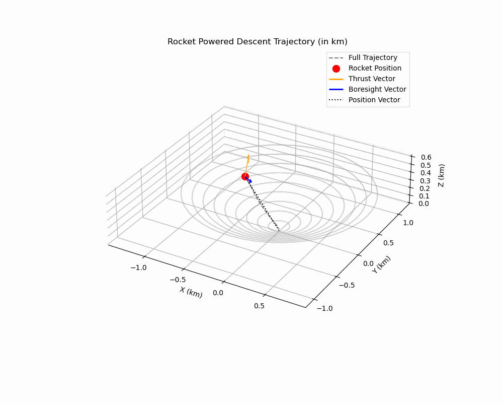

# intrinsic-scvx

# Intrinsic Successive Convexification: Trajectory Optimization on Smooth Manifolds

This repository contains the code and results for the paper **Intrinsic Successive Convexification: Trajectory Optimization on Smooth Manifolds**. The project focuses on **powered descent of a rocket under Martian gravity**, solving trajectory optimization problems under **line-of-sight** and **glide slope** constraints, along with a few other practical constraints. 





The algorithms in this repository use successive convexification (SCvx) with an emphasis on intrinsic methods for more efficient and accurate trajectory optimization on smooth manifolds.


## What is SCvx?

Successive convexification (SCvx) is a sequential convex programming method for constrained trajectory optimization. At its core, its just sequential quadratic programming, but we also include convex functions. It aims to solve a non-linear program of the form:

$$\min_x f(x) \quad \text{subject to} \quad g(x) \leq 0, \quad h(x) = 0$$

Given an initial guess $\bar{x}$, SCvx constructs convex approximations of $f$, $g$, and $h$ around $\bar{x}$:

$$\hat{f}(x, \bar{x}) \approx f(x), \quad \hat{g}(x, \bar{x}) \approx g(x), \quad \hat{h}(x, \bar{x}) \approx h(x)$$

The approximations are then used to reformulate the problem as a convex optimization:

$$\min_{x, v, s} \hat{f}(x, \bar{x}) + \lambda P(v, s) \\ 
\text{s.t. }
\hat{g}(x, \bar{x}) \leq s, \\ \quad \hat{h}(x, \bar{x}) = v, \\ \quad s \geq 0, \\ \quad \|x - \bar{x}\|_2 \leq r$$

Here, $\lambda > 0$ is a penalty term for the slack variables, and $r>0$ defines the trust region radius. This local subproblem is then solved, obtaining the next guess $x^+ = \mathcal{P}(x,r)$. The trust region must be updated in an intelligent manner, which is the core question of trust region optimization. 


This procedure of iteratively refining the convex approximations is the essence of successive convexification. This methodology, at its core, is in fact Sequential Quadratic Programming, which has been around since the 70s. 

## What is Intrinsic SCvx?

In the classical setting, SCvx is typically applied to Euclidean spaces. However, in many real-world applications, the state space of many robotic systems is non-Euclidean. For instance, as a rigid body, the state space of a rocket lies in $$\mathbb{R}^3 \times SO(3) \times \mathbb{R}^3 \times \mathbb{R}^3$$ which we heavily use in this repo. 

Consider also a satellite subjected to a keep-out zone constraint. That is, a fixed body-frame direction $y_b$ must never point towards a particular region:


This constraint is defined over the unit sphere $S^2$.Moreover, robot arms operate in a Lie group state space. 

In my work, I explore how the SCvx paradigm can be extended to a Riemannian manifold setting. I demonstrate this generalization not only enhances the speed and robustness of the SCvx procedure, but also leads to more optimal trajectories that better satisfy the given constraints. This is evidenced by both the theoretical results presented in the paper and the experimental outcomes found in the accompanying code, particularly the plots in the `media/` directory.


With SCvx, the cost of the trajectory slowly rises as its perturbed to satisfy the dynamic and state-control constraints more and more. But as you can see in this plot, the iSCvx methodology produces a trajectory with a significantly lower trajectory cost. 


## Project Structure

### `src/`
The `src` directory contains the core code for the project, including:

- **Classes for Model Construction**: This directory contains the primary classes for constructing the models used in the SCvx algorithms. These models represent the systems being optimized and the various dynamics involved in the optimization process.
  
- **SCvx Algorithms**: The algorithms that implement the successive convexification method (both vanilla and intrinsic SCvx) are located here.

- **`utils.py`**: A collection of utility functions, primarily for quaternion computations. These methods are critical for handling rotations and orientations in the context of trajectory optimization on manifolds.

- **`parameters.py`**: Contains the system parameters used in the models and algorithms. This file holds the configuration values that define the optimization problem.

- **`unit_tests.py`**: A unit test script that verifies the correct functionality of the various components in the project. It ensures that the individual algorithms and utilities work as expected.

### `media/`
The `media` directory stores all the plots and figures that are generated from running the test scripts in the `tests/` directory. If you need visualizations or want to inspect the results of the test runs, this is the place where the output is stored.

### `tests/`
The `tests` directory contains the test scripts that validate the functionality of the different components of the project. It currently includes six test scripts that evaluate:

1. The vanilla SCvx algorithm.
2. The intrinsic SCvx algorithm.
3. Comparisons between the two methods under different conditions:
   - Powered descent of a 6-DOF body in Martian gravity with a terminal attitude constraint.
   - Powered descent of a 6-DOF body in Martian gravity without a terminal attitude constraint.

Each of these scripts runs a specific set of experiments and generates results that demonstrate the effectiveness of the algorithms.

### `data/`
The `data` directory contains the symbolic computations that are saved when a model object is initialized. This is done to save computation time, as recomputing the Jacobians and other symbolic computations can be time-consuming. The files in this directory represent the pre-computed values needed for initializing the models quickly.

### `quat_paper/`
This directory contains the code used for generating the plots and running the experiments presented in the paper. It includes all scripts and utilities required to replicate the results of the experiments described in the paper. If you are looking for the plot generation and experiment scripts, this is the directory to explore. I will eventually merge this into the src directory, so consider this directory deprecated for now.

## How to Use

1. **Install dependencies**:
   Make sure you have all the necessary Python packages installed. You can do this by running:
   ```bash
   pip install -r requirements.txt
2.	Running tests:
    To run all the tests, use the tests directory:
    ```bash
    python tests/classic_scvx_test.py
    python tests/intrinsic_scvx_test.py
    # and so on...
3.	The plots will appear in the media/ directory once the script completes.

### Create Your Own Model

You can create your own model class using the abstract Model class, which is the base class for all models in this project. The SCvx algorithms will work with any model class that extends this abstract class.

To create your own model:

1.	Define a new class that inherits from the ```Model``` class.

2.	Implement the dynamics and their Jacobians: The most important part is defining the system’s dynamics and the corresponding Jacobians, which are essential for trajectory optimization. 

    **Alternatively**: Use SymPy for symbolic computations: In the PoweredDescentModel class, I used SymPy to automatically compute the derivatives of the dynamics. You can follow this approach to simplify the process of computing Jacobians symbolically. Here’s an example of how you can structure this:

```python
import sympy as sp

class MyModel(Model):
    def __init__(self, params: MyModelParameters, cache_file: str, x_init: Optional[np.ndarray] = None):
        super().__init__(params=params, x_init=x_init)
        self.cache_file = "data/" + cache_file
        self._init_params()
        if x_init is None:
            self._set_random_initial_state()
        self._load_or_compute_dynamics()
        self._setup_lambdified_functions()
    
    def _init_params(self):
        # Initialize any parameters specific to your model here
        pass

    def _load_or_compute_dynamics(self):
        # Define symbolic variables
        x, u = sp.symbols('x u')
        
        # Define your system's dynamics here (example)
        f = x + u  # Example dynamics
        
        # Compute the Jacobian using SymPy
        jacobian = sp.Matrix([f]).jacobian([x, u])
        
        with open(self.cache_file, 'wb') as f:
            pickle.dump((dynamics, jacobian), f)